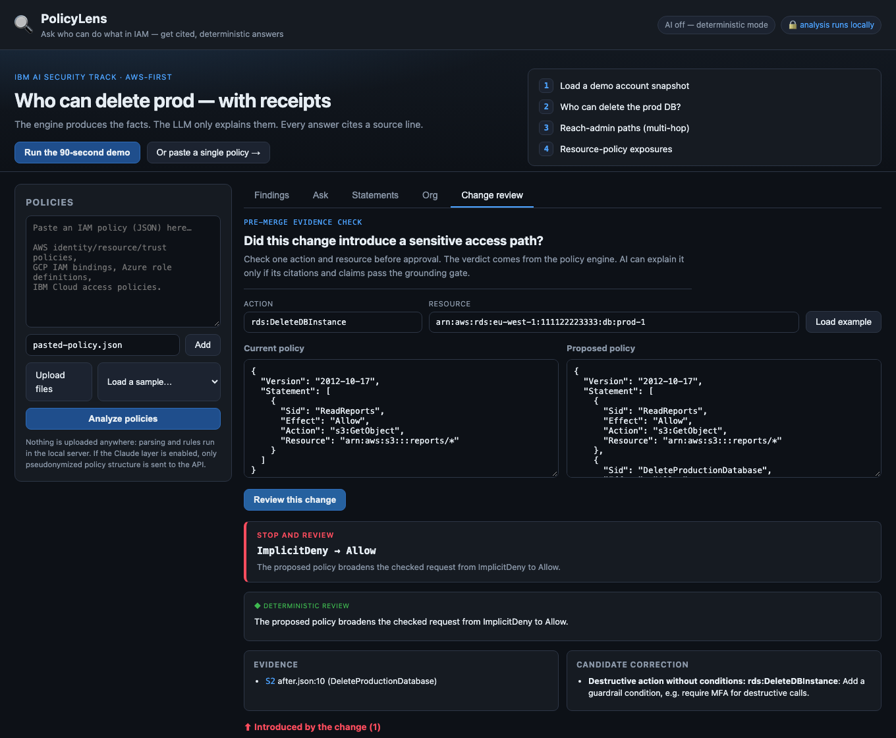
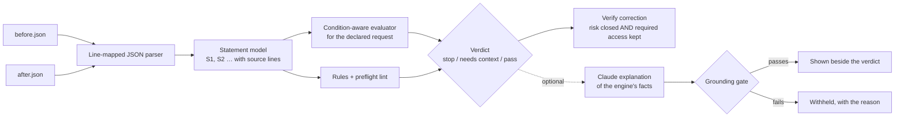

# PolicyLens: evidence-first IAM change review

[](https://github.com/MatthewPaver/iam-policy-auditor/actions/workflows/ci.yml)
[](LICENSE)

For engineers and security reviewers approving AWS IAM policy changes: PolicyLens shows whether a change makes a sensitive action reachable, cites the statement responsible, and checks that a proposed fix closes the path without breaking access that must keep working.



*Change review on the bundled example, running locally with the AI layer off. The verdict, the evidence line and the candidate correction all come from the deterministic engine.*

## The problem

A pull request adds a statement to a role's policy. The reviewer has to answer a narrow question before approving it:

> Did this change make `rds:DeleteDBInstance` reachable on `prod-1`, and does the correction remove that path without breaking the report reader?

Scanners such as Access Analyzer, Prowler and Cloudsplaining produce findings feeds. They do not answer "is this specific request allowed now, when it was not before?" for one change. Pasting the diff into a chatbot gives a fluent answer that cannot be checked and may cite statements that do not exist.

PolicyLens turns "this diff looks risky" into a reproducible **stop**, **needs context** or **pass** verdict for a declared request, with the source line that caused it. It then re-runs the same request against a candidate correction, alongside the access that has to survive. An LLM may explain the result, but it is shown only if its explanation passes a grounding check.

## Quickstart

Node.js 18 or later (CI uses Node 22). No `npm install`, AWS account or API key is needed to run it.

```bash
git clone https://github.com/MatthewPaver/iam-policy-auditor.git
cd iam-policy-auditor
npm run demo        # serves http://127.0.0.1:4177, this machine only
```

The terminal prints `Mode: local` and `AI layer: disabled — set ANTHROPIC_API_KEY to enable`. Then, in the browser:

1. Open the **Change review** tab, click **Load example**, then **Review this change**.
2. Expected result: **Stop and review**, `ImplicitDeny → Allow`, with evidence `S2 after.json:10 (DeleteProductionDatabase)`.
3. Open **Verify a proposed correction** (the corrected policy is pre-filled) and click **Verify correction**. Expected result: **Correction verified**, with `risk closed: yes · required access preserved: yes` for `s3:GetObject` on the reports bucket.

The same check is available over HTTP (`POST /api/change/review`, `POST /api/change/verify`).

**Optional AI explanations.** Set `ANTHROPIC_API_KEY` before starting the server. `AUDITOR_MODEL` overrides the default model (`claude-sonnet-5`). Account IDs, emails and IBM IAM IDs are pseudonymised (`«ACCT_1»`) before the call and restored afterwards.

**Docker (optional).** `docker build -t policylens . && docker run --rm -p 4177:4177 policylens` runs it in shared-demo mode (`HOSTED=1`): it binds all interfaces, throttles POST requests and shows a "do not paste real policies" banner.

## How it works



- **Parser and model** (`src/parse.js`, `src/engine.js`). A position-aware JSON parser maps every statement to its file and line, then normalises it into one statement model (effect, principals, actions, resources, conditions).
- **Evaluator** (`src/evaluate.js`, `src/actions.js`). Evaluates a request with explicit deny > allow > implicit deny, `NotAction`/`NotResource`, wildcard matching and condition operators (String, Bool, Ip, Arn, Numeric, Date, Null, `IfExists`, `ForAllValues`/`ForAnyValue`). A missing context key gives `ConditionalAllow`, never a silent deny. Wildcards expand against 21,656 AWS actions from [iann0036/iam-dataset](https://github.com/iann0036/iam-dataset) (MIT), pinned to a commit with SHA-256 values in `data/aws-actions.provenance.json`.
- **Change review** (`src/change_review.js`). Evaluates the declared request before and after. **Stop** if the decision broadens (for example `ImplicitDeny → Allow`) or the change introduces a high or critical finding; **needs context** if the result depends on condition keys that were not supplied; otherwise **pass**. Correction verification passes only if the risky request is no longer permitted and every declared required-access request still is.
- **Rules and lint** (`src/rules.js`, `src/lint.js`). Wildcard admin, `Allow` + `NotAction`, privilege escalation (`iam:PassRole` on `*`, `iam:CreatePolicyVersion`, …), risky trust policies, unconditioned destructive actions and public exposure. Each finding has a severity, the source lines and a least-privilege rewrite.
- **Optional AI layer** (`src/ai.js`, `src/ai_eval.js`). Claude receives only the engine's facts and must cite `[S2 · file:line]`. The gate withholds the explanation unless the verdict matches, every citation resolves to a supplied statement, permission claims are cited, uncertainty is named where the decision is conditional, and nothing is called "safe" or "compliant".

**Second workflow: org-wide reachability** (`src/snapshot.js`, `src/graph.js`, `src/resource_policy.js`, the **Org** tab). From an exported `aws iam get-account-authorization-details` snapshot it answers "who can do X on Y" with group inheritance resolved, finds who can reach administrator (direct, assume-role chains and named escalation techniques, including multi-hop paths with per-step citations), and flags resource policies that grant access to a foreign account or the public. **Run the 90-second demo** loads `samples/aws-account-snapshot.json`. GCP, Azure and IBM policy documents are parsed and rule-checked in the single-policy **Analyse** view, at less depth than AWS.

## Results

All three checks run offline in CI on every push.

| Check | Command | Result | What it does not show |
|---|---|---|---|
| Unit and contract tests | `npm test` | 118 tests in 11 suites pass | Behaviour on real account data; the fixtures are synthetic. |
| AI grounding contract | `npm run eval` | 6/6 expectations met: 2 grounded explanations accepted; 4 bad ones rejected (invented citation, uncited permission claim, "safe" overclaim, wrong verdict) | Live model quality. These are captured outputs that test the gate, not the model. `npm run eval:live` records real runs, but no results are committed. |
| Authored regression corpus | `npm run benchmark` | Engine agrees with 55/55 cases | Independent accuracy. The author wrote the expected answers from AWS documentation, so this guards against regressions only. |

The independent check is `npm run benchmark:aws`, which compares the engine with AWS's `iam:SimulateCustomPolicy`. It needs credentials with that permission and **has not been run**; [docs/AWS_SIMULATOR_STATUS.md](docs/AWS_SIMULATOR_STATUS.md) records the status and what a run must report. An explicit AWS run fails closed if the CLI, credentials or any comparison is missing, so an offline pass cannot make it green. [docs/AI_EVALS.md](docs/AI_EVALS.md) sets out the pass bar for a live model release.

## Design decisions and trade-offs

- **The engine decides; the LLM only explains.** Rejected: asking an LLM whether the diff is risky. A permission verdict has to be reproducible and point at a statement, and a model answer varies between runs and can invent statements. The explanation is withheld when it fails the gate, not repaired. Cost: questions outside the engine's model get "not evaluated" rather than an answer.
- **Check a declared request, not the whole policy.** Rejected: a full semantic diff or a single risk score. A reviewer can act on "this request went from denied to allowed"; a diff across 21,656 actions is noise. Cost: the reviewer must name the sensitive action and resource. The rules still flag any new high or critical finding outside that request.
- **Verify the fix against the risk and the access that must survive.** Rejected: suggesting a rewrite and stopping there. Least-privilege fixes often break the legitimate reader, so the correction is tested both ways. Cost: required-access cases have to be declared.
- **Zero runtime dependencies.** Rejected: Express and TypeScript. A tool that reads policy data benefits from a small supply-chain surface, and clone-and-run needs no install. Cost: hand-written routing, a 5 MB body cap and a per-IP throttle instead of middleware. ESLint is a dev-only dependency.
- **AWS depth before multi-cloud breadth.** Rejected: equal support for AWS, GCP, Azure and IBM. Evaluation semantics matter more to a security reviewer than coverage, so change review and condition-aware evaluation are AWS-only. Other clouds get parsing and rules.

## Limits and non-goals

- It evaluates only the supplied documents. SCPs, permission boundaries, session policies and cross-account resource-policy interplay are not evaluated, and every review says so.
- A **pass** means no increase for the checked request under the rules that ran. It is not proof that a policy is safe, and a clean scan says it "does not certify the policy safe".
- The grounding gate checks citations, verdict wording and claim patterns. It cannot tell whether a cited statement actually supports the sentence that cites it.
- The escalation catalogue is a documented starter set of well-known techniques, not an exhaustive one. Instance-profile and SSM paths need data that the snapshot does not hold.
- There is no live collector. Org analysis reads an exported snapshot.
- GCP custom roles outside the built-in role map return "cannot determine", not a guess.
- It runs locally by default (`127.0.0.1`). `./demo.sh` binds `0.0.0.0` for a LAN demo; do not use that with real policies on an untrusted network.
- Non-goals: replacing Access Analyzer, Prowler or a CSPM; posting PR comments; hosting it as a multi-tenant service.

## Repository layout and tests

```
server.js                 zero-dependency HTTP server and JSON API
src/change_review.js      before/after verdict and correction verification
src/evaluate.js           condition-aware request evaluation
src/parse.js, engine.js   line-mapped parser, normalised statement model
src/rules.js, lint.js     risk rules and preflight lint
src/actions.js            AWS action catalogue lookup (data/aws-actions.json)
src/graph.js, snapshot.js org-wide who-can and reach-admin
src/resource_policy.js    foreign-account and public resource-policy grants
src/ai.js, ai_eval.js     optional Claude layer and its grounding gate
public/                   web UI
samples/                  example policies, change pair and account snapshot
test/                     11 test suites
evals/                    AI grounding fixtures (offline) and live runner
benchmark/                authored corpus and AWS simulator adapter
scripts/                  action-catalogue ingest (npm run ingest)
docs/                     AI eval strategy, AWS simulator status, screenshot
```

```bash
npm run lint        # ESLint (needs npm ci)
npm test            # unit and contract tests
npm run eval        # offline AI grounding contract
npm run benchmark   # authored regression corpus
```

## Licence

MIT. See [LICENSE](LICENSE).
